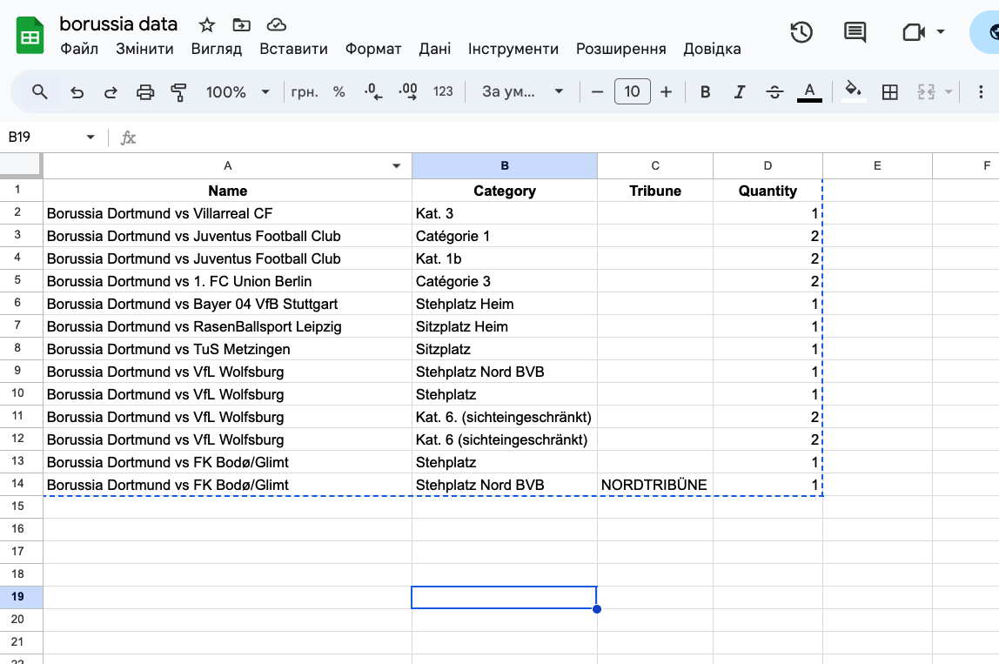

# Table of Contents

- [How it works](#how-it-works)
- [Requirements](#requirements)
- [Get Started](#get-started)
- [Spreadsheet Configuration Sample](#spreadsheet-configuration-sample)
- [Api](#api)

# How it works

On install and on startup the extension background service worker fetches configuration from a Google Sheet and caches it in Chrome storage, then keeps the cache fresh using Chrome alarms. The page script (page.js) watches the site's inline seat-selection data, sanitizes it for JSON, and injects it into the DOM as a hidden ```__seat-selection__``` element so the content script can read it from the page context.

The content script loads the cached sheet settings, identifies the current match on the page, and builds a category -> quantity map from the sheet. It then reads the injected seat data, filters available areas/sub-areas and blocks by the configured tribunes and categories, and uses seat-chain and category filters to find a valid group of seats. If necessary it requests detailed seat info from the site API, prepares from parameters for each seat, and performs the purchase POST requests to add seats to the cart. On success the script submits the seat card form to continue checkout; on failure it logs and triggers the configured notification/alert path. The script also prevents duplicate runs when tickets are already in the cart or the user is on the shopping cart page.

# Requirements

- Running Google Chrome Instance, or Chromium based
- Google Sheets
- (Optional) Node.js to bundle script
- (Optional) Proxies or vpn for ban bypass

# Get Started

1. Go to chrome://extensions, enable Developers mode, and import the extension
2. Give all the necessary permissions to this extension in extensions settings.
3. Configure Google Sheets
4. Choose a desired match on https://www.ticket-onlineshop.com/ols/bvb/en/profis/channel/shop/index.

# Spreadsheet Configuration Sample

All configurations should be written on this table in sheet named "main":
https://docs.google.com/spreadsheets/d/1JbKkPUFsdcH_V2zjFvg2FLLb9XwaQWWouzMIs1Vpy40/edit?gid=0#gid=0

| Name         | Description                                                                                                                                                              |
| ------------ | ------------------------------------------------------------------------------------------------------------------------------------------------------------------------ |
| **Name**     | Full match name exactly as displayed on the ticket website. Used to identify which event the bot should monitor (e.g., *"Borussia Dortmund vs Juventus Football Club"*). |
| **Category** | Ticket category or pricing tier such as *Kat. 3*, *Catégorie 1*, *Stehplatz*, *Sitzplatz Heim*, etc. The bot uses this to filter seats by the correct category.          |
| **Tribune**  | Specific tribune or block, if provided (e.g., *NORDTRIBÜNE*). Most entries may leave this empty, but when filled, the bot uses it to target a specific stadium section.  |
| **Quantity** | Number of tickets you want to purchase for this match. The bot selects offers only when the available seats match this quantity.                                         |


## Spreadsheet Configuration sample


